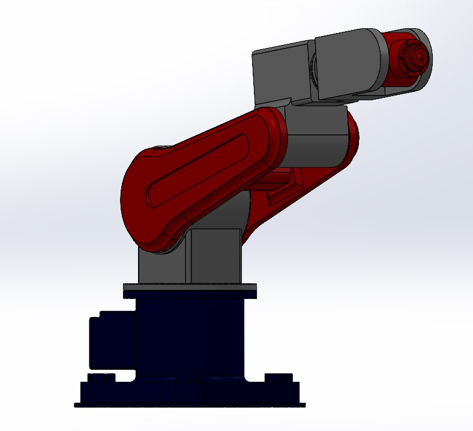
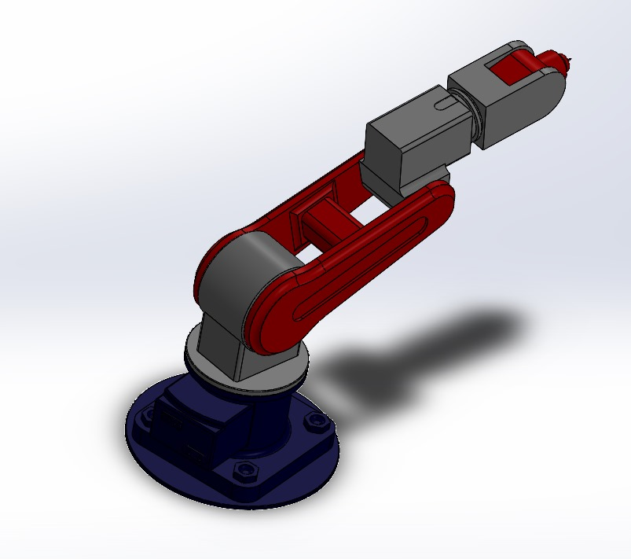
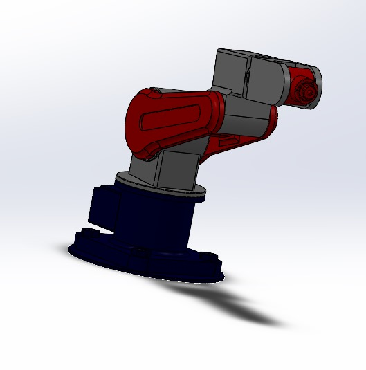
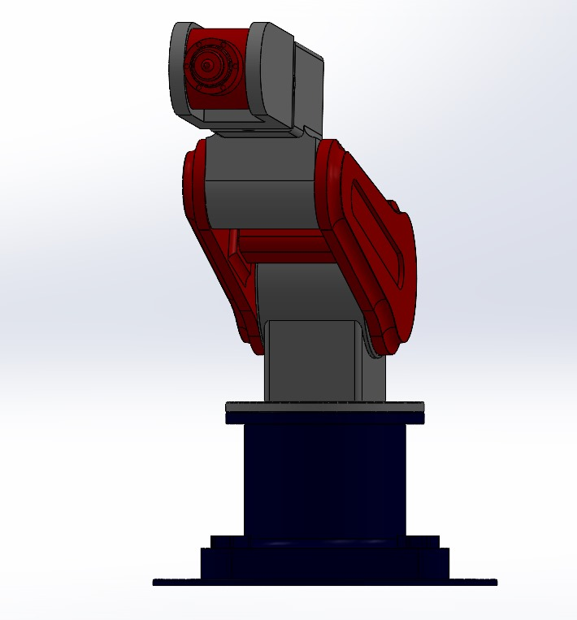

# Industrial Robotic Arm Project

Welcome to the Industrial Robotic Arm Project repository. This project aims to design and develop an industrial robotic arm with precise control and functionality.

## Table of Contents

- [Introduction](#introduction)
- [Design and Mechanism](#design-and-mechanism)
- [Project Structure](#project-structure)
- [Setup Instructions](#setup-instructions)
- [Contact](#contact)

## Introduction

This project focuses on the design and implementation of an industrial robotic arm capable of performing a variety of tasks in an industrial setting. The goal is to create a versatile and efficient robotic solution for automation.

## Design and Mechanism

The design and mechanism of the industrial robotic arm are critical to its functionality and efficiency. This section will cover the following aspects:

- **3D Design and Modeling**: Utilizing CAD software (such as SolidWorks) to create detailed 3D models of the robotic arm.
- **Structural Design**: Developing a robust and reliable structure that can withstand industrial environments.
- **Kinematic Analysis**: Analyzing the movement and motion capabilities of the robotic arm to ensure precise control.
- **Material Selection**: Choosing appropriate materials to balance durability, weight, and cost.
- **Actuation and Control Mechanisms**: Designing the actuation systems (motors, servos) and control mechanisms to achieve accurate and responsive movements.

## Project Structure
<table>
  <tr>
    <td></td>
    <td></td>
  </tr>
  <tr>
    <td></td>
    <td></td>
  </tr>
</table>

## Setup Instructions

## Contact

For any questions or suggestions, please contact:

- Name: Dinethra Rajapaksha
- Email: [divanjanad@gmail.com](mailto:divanjanad@gmail.com)
- YouTube: [YouTube](https://youtu.be/g4LXN7eKzL0)
